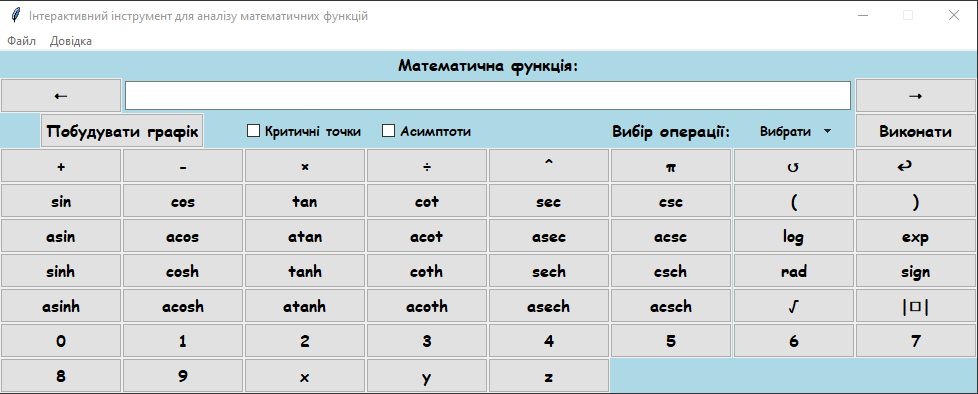
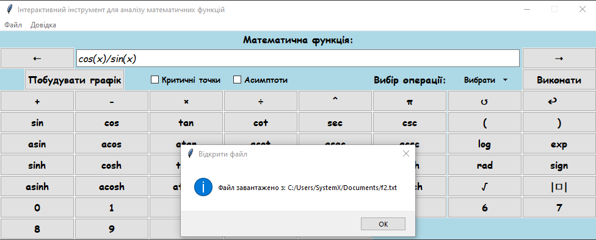
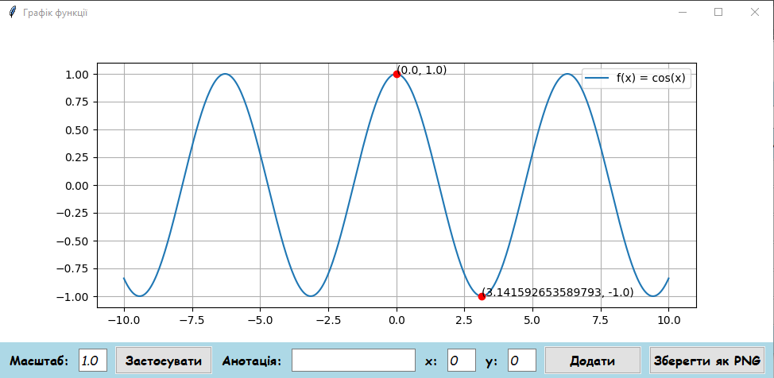
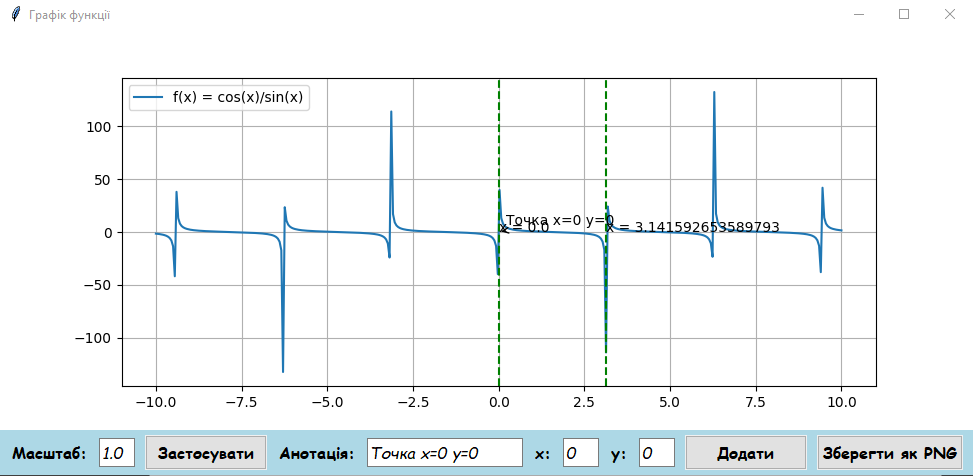
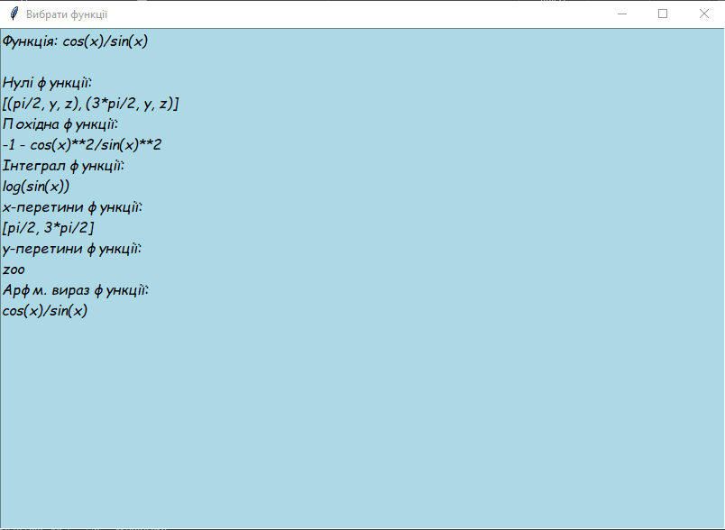

<p align="center"></p>
<h1 align="center">Інтерактивний інструмент для аналізу математичних функцій</h1>

## Description
<b>EN:</b>

One of the coursework on the topic «Designing a graphical user interface (**GUI**) in [**Tkinter**](https://docs.python.org/uk/3/library/tkinter.html)».

<b>This application has the following features:</b>
1. **Implementation of the interface:** A convenient and intuitive interface was created for entering mathematical functions and performing various mathematical operations.
2. **Calculation of mathematical functions:** The program allows you to calculate derivatives, integrals, find zeros of functions, as well as intersections with coordinate axes.
3. **Graphing:** A graphing function has been implemented, including the display of critical points and asymptotes.
4. **Saving results:** It is possible to save graphs in ***PNG*** format and functions in ***LaTeX*** format for further use for scientific and educational purposes.
5. **Ergonomics:** The program interface was developed taking into account the principles of ergonomics, which ensured convenience and ease of use.

<b>UA:</b>

Одна з курсових робіт на тему «Розробка графічного інтерфейсу користувача (**GUI**) в [**Tkinter**](https://docs.python.org/uk/3/library/tkinter.html)».

<b>Даний застосунок має такі функції:</b>
1. **Реалізація інтерфейсу:** Було створено зручний та інтуїтивний інтерфейс для введення математичних функцій та виконання різних математичних операцій.
2. **Обчислення математичних функцій:** Програма дозволяє обчислювати похідні, інтеграли, знаходити нулі функцій, а також перетини з осями координат.
3. **Побудова графіків:** Було реалізовано функцію побудови графіків, включаючи відображення критичних точок та асимптот.
4. **Збереження результатів:** Забезпечено можливість збереження графіків у форматі ***PNG***, а функцій у форматі ***LaTeX*** для подальшого використання у наукових та навчальних цілях.
5. **Ергономіка:** Інтерфейс програми був розроблений з урахуванням принципів ергономіки, що забезпечило зручність та простоту у використанні.

#
## Screenshots
<p align="center">
  
  
  
  
  
</p>

#
## Technologies used
<b>EN:</b>
- Creating a user interface using the library [**Tkinter**](https://docs.python.org/uk/3/library/tkinter.html)
- Work on such platforms as: **Windows, macOS, GNU/Linux**
- Using libraries for calculations ([**NumPy**](https://numpy.org), [**SciPy**](https://scipy.org))
- Using libraries for plotting [**Matplotlib**](https://matplotlib.org)
- Calculation of derivatives, integrals, zeros of functions, as well as intersections with coordinate axes
- Creating an interactive keyboard
- Visualization of graphs through *Canvas*
- Saving graphs in ***PNG*** format, and functions in ***LaTeX*** format

<b>UA:</b>
- Створення користувацького інтерфейсу за допомогою бібліотеки [**Tkinter**](https://docs.python.org/uk/3/library/tkinter.html)
- Робота на таких платформах як: **Windows, macOS, GNU/Linux**
- Використання бібліотек для обчислень ([**NumPy**](https://numpy.org), [**SciPy**](https://scipy.org))
- Використання бібліотек для побудови графіків [**Matplotlib**](https://matplotlib.org)
- Обчислення похідних, інтегралів, нулів функцій, а також перетини з осями координат
- Створення інтерактивної клавіатури
- Візуалізація графіків через *Canvas*
- Збереження графіків у форматі ***PNG***, а функцій у форматі ***LaTeX***

#
## License
```
© 2024, CoolOtaku (ericspz531@gmail.com)
```
